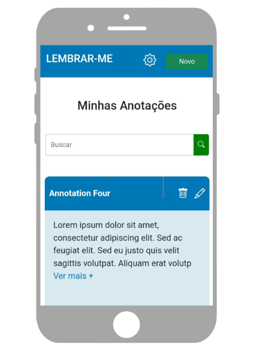

     

<h1 align="center"> ⭐ Front-End consuming API data</h1>

  ⭐ This is the README file for the LEMBRAR-ME Website. It provides information about website technologies, how to use it, and how to contribute to the project.

  <a href="#introduction"> 🧩 Introduction </a>&nbsp;&nbsp;&nbsp;|&nbsp;&nbsp;&nbsp;
  <a href="#tools"> 🛠 Technologies Used</a>&nbsp;&nbsp;&nbsp;|&nbsp;&nbsp;&nbsp;
  <a href="#screen"> Screen </a>&nbsp;&nbsp;&nbsp;&nbsp;&nbsp;&nbsp;|
  <a href="#installation"> 🧪 Installation</a>&nbsp;&nbsp;&nbsp;|&nbsp;&nbsp;&nbsp;
  <a href="#contribute">💡 Contribute</a>&nbsp;&nbsp;&nbsp;|&nbsp;&nbsp;&nbsp;
  <a href="#credits"> 🏆 Credits </a>&nbsp;&nbsp;&nbsp;&nbsp;&nbsp;&nbsp;

 

## 🧩 Introduction

**⭐ This front-end makes a request to the API and receives the data in JSON format. This data is then manipulated using JavaScript and displayed on the page. The front-end has an extremely intuitive and pleasant interface, making it possible for anyone to use it without any difficulty.**
 
 

## 🛠 Technologies Used
- HTML5
- CSS3
- Sass
- JavaScript
- Bootstrap
 

## Screens
### 🤳🏻 Mobile

⭐ Home | ⭐ Login | ⭐ Annotations
|---|---|---
 |  | 

### 💻 Desktop 

⭐ Home | ⭐ Login | ⭐ Annotations
|---|---|---
 |  | 
 

## Installation
<h4>Step-1</h4> Clone the repository to your computer:
<code>https://GScripter.github.io/lembrar-me_website.git</code>
<h4>Step-2</h4> Navigate to the project folder:
<code>cd lembrar-me_website</code>
<h4>Step-3</h4> Open the index.html file in a browser of your choice and You're all set! Now the project is running in your browser. 

## 💡 How to contribute
If you would like to contribute to this project, please follow the steps below:

1- Create a fork of this repository by clicking the "Fork" button in the top right corner of the page.

2- Clone your fork to your local machine:
`git clone https://github.com/your_username/repository_name.git`

3- Create a branch for your changes:
`git checkout -b my_feature_branch`

4- Make desired changes to the code and add your files using the `git add .` command.

5- Ensure your code passes all tests.

6- Commit your changes with a clear message of what was done:
`git commit -m "Added new feature"`

7- Push to the branch you created on your fork:
`git push origin my_feature_branch`

8- Open a pull request to this repository by clicking the "New Pull Request" button on your fork's repository page.

9- Wait for the project reviewer to evaluate your code.

Thank you for your contribution!

## License
***This project is licensed under the MIT. See the LICENSE file for more information.***
 
 

## 🏆 Credits

  ### ***⭐ For every project we have to give credits to the creators so nothing better than finishing with a golden key with the creators / creator of the project***.

  

 

| [  Gabriel Santana ](https://www.linkedin.com/in/gabrielsantana444) | ***Hello 😃 If you made it this far, I believe you liked my project, in which case we have something in common, so how about we talk a little? My call on linkedin*** 😁 |
|---|---|

